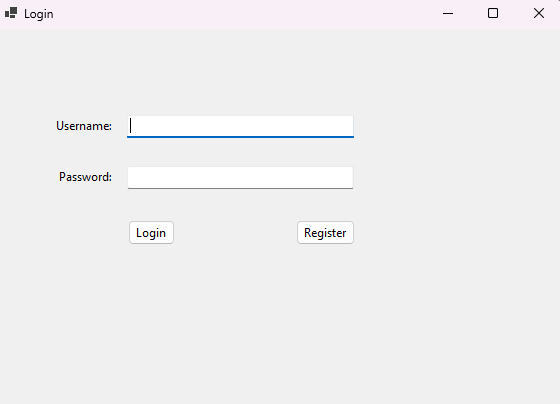
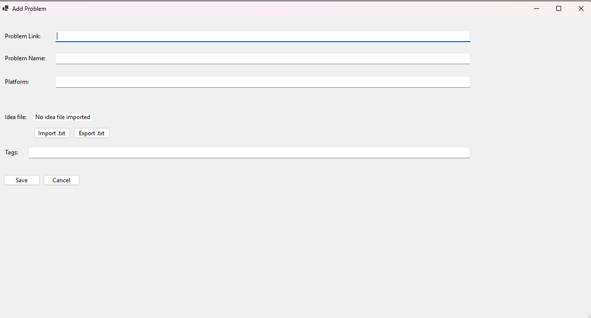
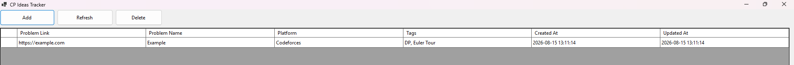

# CP Ideas Tracker

**CP Ideas Tracker** is a desktop application designed for competitive programmers who want to keep track of their problem solving ideas without writing them directly inside their source code.

When solving competitive programming problems, comments can sometimes reveal an important observation, technique, or even the full solution idea. CP Ideas Tracker gives you a separate place to store those ideas and associate them with the problems you solve.

## ✨ Features

### 🔐 User Authentication

Login and registration system.

Each user can manage their own problem collection.

### ➕ Add Competitive Programming Problems

For every problem, you can store:

1. Problem link
2. Problem name
3. Platform
4. Tags
5. Solution idea or notes

### 🧠 Keep Solution Ideas Separate From Your Code

Store the reasoning, observations, or key concepts behind a problem without adding comments to your source code.

### 📄 Import and Export Ideas

Ideas can be imported from a `.txt` file and exported to a `.txt` file.

### 🏷️ Problem Tags

Problems can be organized using tags such as Dynamic Programming, Graphs, Greedy, Euler Tour, Binary Search, and many others.

### 🕒 Automatic Timestamps

The application keeps track of when a problem was created and when it was last updated.

### 🗑️ Problem Management

You can add problems, delete problems, and refresh your problem list directly from the main panel.

## 🎯 Why CP Ideas Tracker?

Competitive programming is not only about writing code. The most valuable part is often the **idea behind the solution**.

Instead of writing something like:

```cpp
// Use Euler Tour to flatten the tree.
// Then process subtree queries using the required data structure.
```

directly inside your source code, you can keep that explanation inside CP Ideas Tracker.

This keeps your implementation clean while your reasoning remains organized and easy to revisit later.

## 📸 Screenshots

### Login



### Main Panel


### Adding a Problem



### Example Problem



## 🚀 How It Works

1. Create an account or log in.
2. Add a competitive programming problem.
3. Enter the problem link, name, platform, and tags.
4. Save your solution idea separately from your source code.
5. Return to it whenever you want to review the problem.
6. Export the idea to a `.txt` file when needed.

## 💡 Example

```text
Problem: Example
Platform: Codeforces
Tags: DP, Euler Tour

Idea:
Flatten the tree using an Euler Tour.
Each subtree becomes a continuous interval.
Process that interval using the appropriate data structure.
```

## 🎯 Project Goal

The goal of CP Ideas Tracker is to provide competitive programmers with a simple personal knowledge base for the problems they solve.

Instead of remembering only whether a problem was solved, you can preserve the **actual insight that led to the solution**.

## 🔮 Possible Future Improvements

1. Search problems by name
2. Filter problems by platform or tag
3. Edit existing problems
4. Dark mode
5. Favorite problems
6. Difficulty or rating field
7. Sorting and advanced filtering
8. Statistics by platform and topic

## 🤝 Contributing

Suggestions, bug reports, and contributions are welcome.

Feel free to open an issue or submit a pull request.

## ⭐ Support

If you find CP Ideas Tracker useful, consider giving the repository a ⭐.

It helps support the project and its future development.
